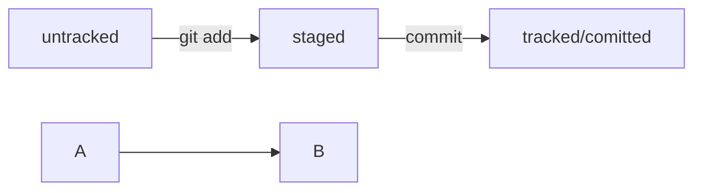

# basic-git-commands
Repository for basic git commands.  
<br>
## git init

- Инициализация пустого репозитория (в текущей папке)
```
git init
```

## git status

- Команда git status показывает состояния файлов в рабочем каталоге и индексе<br>
```
git status
```

## git add

- Команда git add добавляет содержимое рабочего каталога в индекс (staging area) для последующего коммита.<br>
```
git add filename
git add --all
```

## git commit

- Команда git commit берёт все данные, добавленные в индекс с помощью git add, и сохраняет их слепок во внутренней базе данных, а затем сдвигает указатель текущей ветки на этот слепок.<br>
```
git commit -m "comment about changes"
```

## git log

- Просмотр истории коммитов<br>
```
git log  // вывести список коммитов (выход - Q)
git log -1   // посмотреть последний коммит (N последних коммитов)
git log –oneline - одной строкой (с сокращенным хешем)
```

## git push

- Отправка изменений в удалённый репозиторий<br>
```
git push -u origin master // в первый раз, -u для связи локальной ветки с одноимённой удалённой.
git push
```

## Хеш

Хеш — идентификатор коммита  (алгоритм SHA-1)<br>
```
commit 845ecbcce04d6cb5737b2e20ef997abc67e8803f
```

## HEAD

Файл HEAD в папке .git указывает на коммит, который сделан последним.<br>
Внутри HEAD — ссылка на служебный файл: refs/heads/main, а в нем - хеш последнего коммита.<br>
Многие команды Git принимают в качестве параметра хеш коммита.<br> Если нужно передать последний коммит, то вместо его хеша можно просто написать слово HEAD — Git поймёт, что вы имели в виду последний коммит.
```
cat refs/heads/main // посмотреть этот файл.
```

## Статусы файлов

untracked - неотслеживаемый. В "git status" выводится "Untracked files".<br>
staged - подготовленный к коммиту командой git add, находится в staging area (index, cache). В "git status" выводится "Changes to be committed".<br>
tracked - отслеживаемый: когда-то закоммиченный или добавленный в staging area.<br>
modified - измененный по сравнению с последней версией (после коммита или после git add). В "git status" выводится "Changes not staged for commit". Изменения не войдут в коммит.<br>

